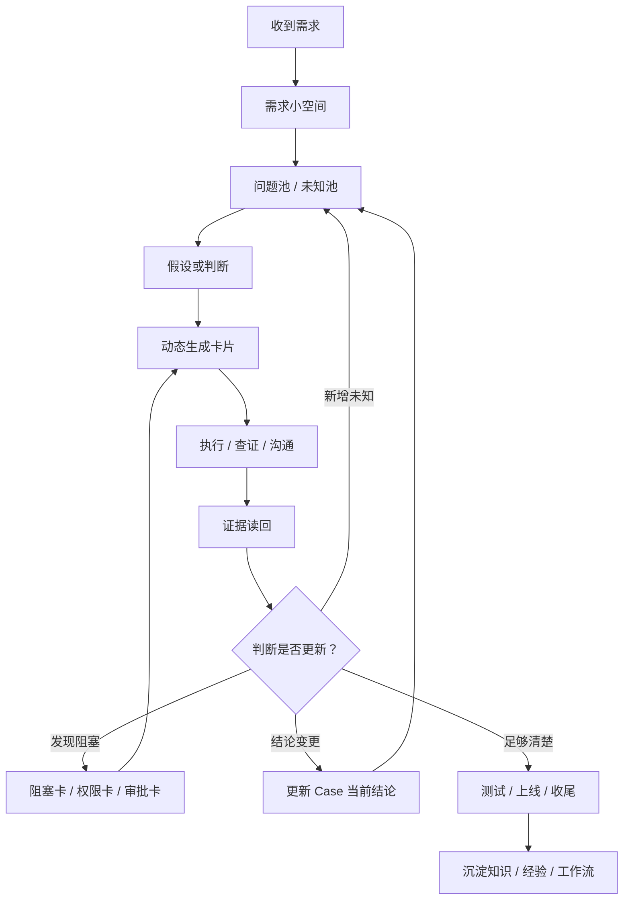
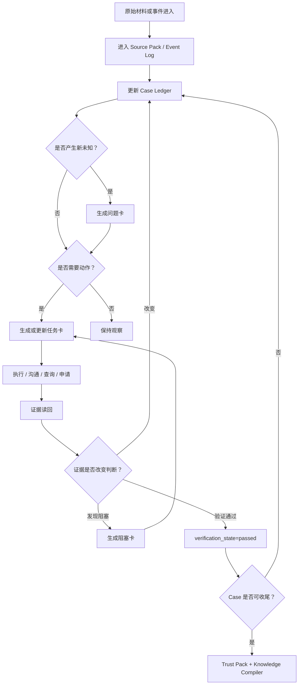
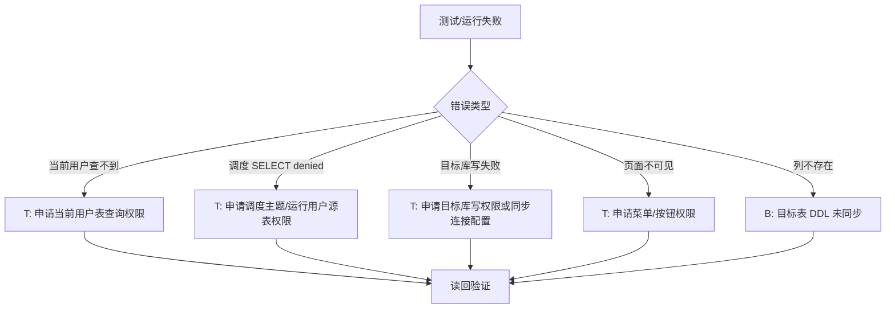

# 数据开发需求 Case Workbench 初步设计

更新时间：2026-07-06

本文记录 `Data-Engineering-Workbench` 下一阶段的产品/工程设计方向。它不是 OpenCLI 适配器说明，也不是通用知识库方案；它描述一个围绕数据开发真实需求运行的 **Case Space** 工作台。

配套评估文档：`references/research/workbench-best-practices-evaluation.md`。该文档结合官方/开源/行业实践与本地 `agent-kb`，用于约束本设计不要过早平台化、前端化或多 Agent 化。

第二轮复审吸收记录：`references/research/workbench-openai-audit-v2-absorption.md`。该记录将当前重点从“继续砍对象”改为“冻结可执行协议”：受限自然语言意图、Agent 执行七步、状态转移 guard、evidence sidecar 和结构化 closeout。

`agent-env` 知识吸收记录：`references/research/workbench-agent-env-knowledge-absorption.md`。该记录把 `data-push-analysis` 中的路径路由、真相环境、时间语义和核验顺序吸收到 Workbench，但不复制整个 Skill。

`agent-kb` 知识吸收记录：`references/research/workbench-agent-kb-knowledge-absorption.md`。该记录明确 agent-kb 是长期知识源和经验晋升目标，Workbench 运行时只按需取小包知识。

只读 Dashboard 吸收记录：`references/research/workbench-readonly-dashboard-absorption.md`。该记录将前端方向收敛为 `case-dashboard-generator`：只读、生成式、可丢弃，不是 Workbench 本体。

更准确地说，它是一个轻量的 **数据开发需求小系统**：不是把流程步骤提前写死，而是把每个需求里的问题、任务、阻塞、证据、决策、工具能力和经验沉淀组织成一个会随真实进展演化的系统。

核心术语见仓库根目录的 `CONTEXT.md`，尤其要区分 Source Pack、Candidate Fact、Evidence 和 Current Trusted Conclusion。

## 设计目标

把一个数据开发需求变成一个可持续推进、可核验、可沉淀的小空间：

```text
需求进入
  -> 人和 Codex 共同分析
  -> 动态生成任务卡、阻塞卡、证据卡
  -> 用 CLI / 浏览器 / 人工沟通读回状态
  -> 测试环境核验
  -> 上线/升级/生产读回
  -> 从真实过程里沉淀知识、经验和工作流
```

成功标准不是“文档写得多”或“CLI 命令多”，而是下一次相似需求里：

- 少查几轮。
- 少一次人工纠偏。
- 少一次权限、字段、口径、环境误判。
- 更早发现阻塞项卡在哪个人、哪个系统、哪个审批。
- 更容易证明当前结论可信。

## 核心判断

### 1. 一个需求就是一个小空间

工作台的基本单位不是命令、文档或任务，而是一个需求 Case。

每个 Case 至少回答：

- 这个需求现在处于什么阶段？
- 当前可信结论是什么？
- 哪些结论只是历史分析或暂时假设？
- 当前有哪些任务卡、阻塞卡、待确认问题？
- 哪些卡在我、Codex、合作方、审批人或平台状态上？
- 哪些内容已经通过测试/生产读回验证？
- 哪些经验值得沉淀为知识、规则、流程或 CLI 能力缺口？

### 2. 拆任务是动态的，不是固定菜单

不同需求会长出不同任务。不要把 Case 固定拆成“采集批次 / DM / 推送 / 数据集 / 权限 / 下游”这样的静态树。

更准确的模型是：



固定的是“卡片机制”和“证据门禁”，不是子任务分类。

### 3. 历史 raw 只作线索，不作当前事实

`E:\02_area\数据开发-笔记本\raw\开发工作\数据开发\股衍` 和 `已完结需求` 里有很多高价值材料，但其中不少内容可能与当前实际不同步。

常见原因：

- 当时是个人分析，不是最终执行状态。
- 合作方后来改了任务、DDL、权限、周期、目标库，但没有同步到笔记。
- 测试环境和生产环境状态不同。
- 需求口径、目标表、任务 ID、运行结果发生过后续调整。

因此 Case Space 必须区分：

| 层级 | 含义 | 是否可直接当当前事实 |
| --- | --- | --- |
| 历史分析 | 当时推理、方案、风险判断 | 否，只作线索 |
| 合作方反馈 | 群聊、Flow、Jira、口头同步 | 需标注来源和时间 |
| 平台读回 | Horae、szdata、DSP、flow、数据库只读结果 | 可作为当前证据，但要记录环境和时间 |
| 人工确认 | 用户或合作方明确确认 | 可作证据，但要记录确认范围 |
| 当前可信结论 | 综合证据后的 Case 当前判断 | 可以指导下一步 |

### 4. CLI 是能力底座，不是固定按钮

`C:\Users\13246\.opencli\clis` 当前包含：

| Site | 工作台能力 |
| --- | --- |
| `flow` | 流程、待办、已办、申请、审批意见、流转日志 |
| `horae` / `horaetest` | 调度任务、实例、血缘、数据源、主题 |
| `dsp` / `dspdev` | 数据服务接口、调用日志、接口详情、血缘、实现逻辑 |
| `szdata` / `szdatatest` | 数综资产、需求、子任务、权限、数据集、宽表、测试验证 |
| `szdata_detail` / `szdatatest_detail` | 低频诊断、解释、历史、日志、字典、配置读回 |

但是 CLI 会继续演化，甚至可能被另一个 agent 正在修改。Case Space 不能直接绑定具体命令作为唯一真相。

正确模型：

```text
Case 层：业务需求、当前结论、任务卡和进度
能力层：需要什么能力，例如查任务、查权限、建子任务、核验推送
工具层：当前用哪个 CLI / 浏览器 / 人工流程实现能力
证据层：读回了什么，能证明什么，不能证明什么
```

任务卡绑定的是“能力契约”，具体 CLI 命令只是当前实现。

## 小系统模型

这个 Workbench 可以理解成一个围绕 Case 运转的小系统，而不是一组静态 Markdown 模板。

成熟模型可以拆成八个概念，但 MVP 不应该把八个概念都做成独立目录或独立系统对象：

| 模块 | 作用 | 典型产物 |
| --- | --- | --- |
| Source Pack | 接收需求说明、流程、附件、聊天记录、截图等原始输入 | `00-原始需求背景/` |
| Case Ledger | 记录一个需求的当前状态、可信结论、边界和下一步 | `case.yaml` |
| Event Log | 记录需求变化、证据读回、审批推进、工具失败等事件 | `events.md` |
| Card Board | 承载动态任务、阻塞、问题、证据、决策和沉淀 | `cards/*.md` |
| Capability Registry | 把“要解决的业务能力”映射到当前可用工具或人工路径 | `capabilities.md` / 文档内表格 |
| Evidence Store | 保存能支撑结论的读回材料，带环境、时间和限制 | `evidence/` |
| Trust Pack | 收口时证明“为什么现在可以上线/归档/交付” | `closeout.md` / 后置 `trust-pack/` |
| Knowledge Compiler | 从真实 Case 中提炼可复用知识、规则、工作流、CLI 缺口 | `distilled/` |

外部审计后，MVP 收缩为六个文件级容器：

```text
cases/
  CASE-xxxx/
    case.yaml
    notes.md
    events.md
    cards/
    evidence/
    closeout.md
```

映射规则：

- Source Pack 可以先体现在 `notes.md` 的原始材料索引中；必要时再放 `00-原始需求背景/`。
- Capability Registry 先作为卡片字段 `capability`，不单独建注册中心。
- Change Pack / Trust Pack / Learning Pack 先合并为 `closeout.md` 的三个章节。
- Knowledge Compiler 先只产生 `promotion-inbox` 语义，经过真实复用后再晋升。

这个系统的关键不在于页面多漂亮，而在于它能让需求状态持续被“读回”和“改写”：



固定的是这些系统对象和反馈关系；变化的是每个 Case 具体长出哪些卡片。

### 系统不变量

无论需求怎么变化，下面几条规则不变：

- 一个 Case 必须有一个当前可信结论；没有结论时，也要明确写“未知在哪里”。
- 每张任务卡必须有负责人、执行状态、验证状态、完成标准和验证方式。
- 每个当前结论都应能追溯到 Claim；Claim 要能被证明、推翻或标记过期。
- 每条证据必须记录来源、环境、时间和限制。
- `verified` 不是独立状态，而是 `execution_state=done` 且 `verification_state=passed` 的派生判断。
- 原始需求背景只能生成候选事实、问题和线索，不能直接变成当前可信结论。
- 历史分析不能直接覆盖当前事实，只能作为线索进入 Case。
- 工具失败和业务阻塞要分开记录：CLI 坏了是工具状态，权限没批是业务状态。
- 每次收尾只沉淀会改变下次行为的东西，不把全部过程搬进知识库。

## 动态迭代机制

动态迭代不是“每次手工重写流程图”，而是让 Case 在事件驱动下不断刷新。

### 1. Case 内循环

一个 Case 每天都在这个循环里推进：

```text
新增信息
  -> 进入 Source Pack 或 Event Log
  -> 提取候选事实 / 待确认问题 / 风险点
  -> 更新当前可信结论或未知池
  -> 生成 / 拆分 / 合并 / 作废卡片
  -> 执行卡片或等待外部推进
  -> 读回证据
  -> 更新状态
  -> 产生下一轮动作
```

因此卡片不是一开始拆完就固定。常见变化包括：

- 新证据推翻原方案，旧任务卡标记 `obsolete`。
- 一个大任务执行后暴露权限问题，拆出权限申请卡和审批跟踪卡。
- 合作方反馈目标表已改名，新增 DDL 核验卡并更新当前结论。
- CLI 当前不可用，业务卡保持不变，另开工具健康卡或改走浏览器/人工路径。
- 测试通过后，不直接归档，而是新增上线核验卡和生产读回证据卡。

### 2. 事件驱动更新

建议每个 Case 维护一个轻量 `events.md`，记录会改变状态的事件。

事件类型可以先保持简单：

| 事件类型 | 例子 | 可能触发 |
| --- | --- | --- |
| `source_added` | 新增聊天记录、流程截图、需求附件 | 更新 `source-index.md`，提取候选问题 |
| `demand_change` | 需求方新增字段或改口径 | 更新 Case 结论，新增分析卡 |
| `evidence_readback` | Horae 实例 SUCCESS、目标表有数据 | 验证卡片，更新证据索引 |
| `permission_block` | SELECT denied、页面不可见 | 新增权限卡或阻塞卡 |
| `external_confirm` | 合作方确认 DDL 已同步 | 更新阻塞状态，安排读回 |
| `tool_failure` | OpenCLI 命令加载失败或字段解析错 | 新增工具健康卡，切换 fallback |
| `approval_update` | Flow 到下一审批节点 | 更新等待状态和负责人 |
| `prod_verify` | 生产读回通过 | 更新 Trust Pack 和收尾判断 |
| `learning_candidate` | 发现可复用误判/套路 | 生成沉淀卡 |

事件不需要很重，可以是这样的：

```markdown
## 2026-07-06 14:20 source_added

- 来源：聊天记录-20260706.md
- 内容：合作方提到目标表已建好
- 影响：只作为候选事实，不能直接标记 DDL 已同步
- 新增卡片：T-004 读回目标表 DDL

## 2026-07-06 15:10 evidence_readback

- 来源：horae instance
- 内容：测试调度实例成功，但目标表暂无新增数据
- 影响：T-005 可保持 `execution_state=done`，但 `verification_state` 不升为 `passed`
- 新增卡片：Q-004 目标表加载模式是否为覆盖？
```

### 3. 卡片生命周期

卡片不是待办清单，而是 Case 状态的局部视图。外部审计后，状态模型从单链路改成两个正交轴：执行状态和验证状态。

```yaml
execution_state: todo | doing | waiting | blocked | done | cancelled | obsolete
verification_state: n/a | pending | passed | failed
```

`verified` 不再是卡片状态，而是派生判断：

```text
execution_state=done && verification_state=passed
```

关键约束：

- `waiting` 表示下一步明确，只是在等别人、审批或平台状态。
- `blocked` 表示卡住且下一步不清楚，或者需要重新分析。
- `done` 只表示动作完成，不自动代表可信。
- `verification_state=passed` 表示完成标准已经被读回证据支撑。
- `verification_state=failed` 表示已执行动作被证据推翻，需要返工或重拆卡。
- `obsolete` 表示需求或结论变化导致此卡不再适用，不能直接删除。

### 4. 复杂排查的推测式调查模式

简单卡片不需要调查树。只有当 Case 存在多种合理解释、跨系统责任边界或数据未到/口径不一致等复杂问题时，才启用推测式调查：

```text
根问题
  -> 3-5 个候选原因分支
  -> 每个分支一个低成本只读验证动作
  -> 证据挂到对应 branch/card
  -> 分支被支持、否定、暂停或合并
  -> 最终结论进入 claim / decision / closeout
```

推测阶段默认只读。生产写入、重跑、改配置、提交审批和对外发送结论必须等根因确认后，进入独立任务卡和审批边界。

### 5. 工具能力迭代

CLI、浏览器路径和人工流程都是工具实现，不是 Case 的核心语义。

当某个能力被频繁使用，可以这样演化：

```text
人工判断
  -> Case 任务卡模板
  -> 半自动命令或浏览器步骤
  -> OpenCLI 能力
  -> Skill / Workflow
  -> Evals 或核验清单
```

反过来，如果工具变动或失效，也不应该让 Case 崩掉：

```text
能力：核验调度主题源表权限
当前工具：szdata table-permission-topic
工具状态：changing / broken
fallback：Horae 主题用户 + Ranger 策略 + 应用详情 + 人工确认
业务判断：仍然 waiting 或验证通过，取决于读回证据
```

### 6. 知识迭代

知识不是在 Case 开始前预置完整，而是在真实使用中被编译出来。

```text
Case Trace
  -> 沉淀候选
  -> 分类：事实 / 规则 / 过程 / 经验
  -> 先进入 promotion-inbox
  -> 路由：agent-kb / workbench docs / skill / workflow / AGENTS / CLI gap / eval
  -> 下次 Case 命中
  -> 验证是否真的减少误判或等待
```

如果一条经验下次没有被命中，或者命中后没有减少工作量，就说明它还不是好知识，要么改写，要么降级为历史案例。

MVP 阶段不维护完整 `workbench-knowledge/` 分类体系。先只记录候选沉淀，至少在两个真实 Case 中复用后，再进入 card template、workflow pattern 或 capability contract。

### 7. 迭代节奏

第一阶段可以用很朴素的节奏：

| 节奏 | 做什么 | 产物 |
| --- | --- | --- |
| 每天打开 | 看所有进行中 Case 的阻塞、等待、下一步 | dashboard / `case.yaml` |
| 每次拿到新信息 | 写事件，更新结论或卡片 | `events.md` / `cards/*.md` |
| 每次执行工具 | 保存关键证据，说明能证明什么 | `evidence/` / 证据卡 |
| 每个阶段结束 | 更新验证结论，确认是否可进入下一阶段 | `case.yaml` / `closeout.md` |
| 每个 Case 收尾 | 编译少量高价值经验 | `closeout.md` |
| 定期回看 | 把高频卡片升级为模板、命令或 Skill | `references/` / `skills/` |

总体指标不是“知识越多越好”或“卡片越多越好”，而是可信变更吞吐量：单位人工投入内，通过证据、核验和人类判断接受的数据变更数量。每个 Case 都应同时回答“改了什么”和“为什么可信”。

这使 Workbench 可以从“文件化小系统”开始，随着真实需求自然长出 dashboard、模板、CLI 命令、Skill 和评估用例。

## Workbench Knowledge Layer

Workbench 需要一层自己的运行知识，但不应该复制一套完整知识库。

推荐定位：

```text
Data-Engineering-Workbench/workbench-knowledge/
  = 让 Case 系统更好运行的知识层

E:\02_area\数据开发-笔记本\agent-kb
  = 正式、长期、跨场景复用的知识库
```

两者边界：

| 问题 | 放 Workbench Knowledge Layer | 放 agent-kb |
| --- | --- | --- |
| 它是否直接驱动 Case 运行？ | 是，例如卡片模板、能力契约、核验清单 | 否，除非已抽象成稳定方法论 |
| 它是否是股衍业务事实？ | 一般不放，只保留链接或候选 | 是，例如表、字段、业务概念、系统说明 |
| 它是否还没验证？ | 放 `promotion-inbox/`，标明来源 Case | 不放正式区 |
| 它是否是工具/平台边界？ | 是，例如 szdata/horae/dsp/flow 使用规则 | 只有稳定到通用方法时才外溢 |
| 它是否能被多个 Case 复用？ | 先放模板或 pattern，跑过几次再晋升 | 已验证后进入正式知识 |

后置目录目标如下。MVP 阶段只要求 `promotion-inbox` 语义，不要求维护全部目录：

```text
workbench-knowledge/
  README.md
  routes.md
  card-templates/
    README.md
  workflow-patterns/
    README.md
  capability-contracts/
    README.md
  promotion-inbox/
    README.md
  promotion-log.md
```

### 知识路由

Case 收尾时，`closeout.md` 或 `promotion-inbox` 里的候选按下面规则路由：

| 候选类型 | 例子 | 首选去向 |
| --- | --- | --- |
| Case 现场记录 | 本次聊天、附件、执行细节、临时判断 | 留在 Case，不进入知识层 |
| 原始材料索引 | 需求说明、流程、聊天记录摘要 | 留在 `notes.md`；材料较多时再放 `00-原始需求背景/source-index.md` |
| 平台读回证据 | Horae 日志、Flow 状态、表结构读回 | 留在 Case `evidence/` 或 `closeout.md` |
| 卡片模板 | 申请表查询权限、调度主题权限、DDL 核验 | `workbench-knowledge/card-templates/` |
| 工作流模式 | 新增推送任务核验、采集批次分析、上线读回 | `workbench-knowledge/workflow-patterns/` |
| 能力契约 | 查流程状态、查调度实例、查表权限 | `workbench-knowledge/capability-contracts/` |
| 未审核经验 | 合作方未同步导致历史分析失真 | `workbench-knowledge/promotion-inbox/` |
| 已验证业务知识 | 表含义、字段口径、系统概念 | `agent-kb/股衍/` 或 `agent-kb/数据开发/` |
| 已验证工程方法 | Case 工作法、经验编译法、评估门禁 | `agent-kb/工程方法/` 或 `agent-kb/知识库设计/` |
| 工具缺口 | 缺一个 OpenCLI 命令、命令输出不适合 Agent | Workbench 记录 CLI gap，成熟后进 OpenCLI 源码 |
| 全局执行规则 | 生产写入边界、读回才算完成 | Workbench 文档 / `AGENTS.md` / Skill |

### 晋升流程

```text
Case closeout
  -> promotion-inbox
  -> 分类和去重
  -> 试用于下一个相似 Case
  -> 确认能减少误判、等待或重复查询
  -> 晋升到 agent-kb / workbench docs / skill / CLI / eval
  -> 必要时写入 promotion-log
```

晋升标准：

- 能改变下一次 Case 的行为。
- 有至少一个真实 Case 来源。
- 有明确适用边界和反例。
- 不只是“当时发生过”，而是能被复用。
- 不与 agent-kb 现有正式知识冲突；冲突时以正式知识为准，或发起修订。

降级标准：

- 下次 Case 没命中。
- 命中后没有减少工作量。
- 容易误导或过度泛化。
- 只适用于单个历史需求。

### 运行原则

- Workbench Knowledge Layer 服务 Case 运行，不作为正式业务真相源。
- agent-kb 是长期知识库；Workbench MVP 只保留候选经验和晋升入口，模板/能力契约必须来自真实复用。
- Workbench 内可以链接 agent-kb，但不要复制大段正式知识。
- Case 证据不要搬进知识层；知识层只描述模式，证据留在 Case。
- 每条候选最好能追溯到来源 Case 和触发事件。

### 从 agent-kb 取知识

运行中的 Case 可以读取 `E:\02_area\数据开发-笔记本\agent-kb`，但不能整体加载。读取协议采用：

```text
match -> expand -> verify -> act
```

| 步骤 | Workbench 行为 |
| --- | --- |
| `match` | 从 `index.md`、标题、aliases、tags、description 匹配 3-8 个候选笔记 |
| `expand` | 沿 See Also、wikilink、同目录邻居展开必要依赖 |
| `verify` | 判断知识是否覆盖当前 Case，是否需要回源、读平台、问用户 |
| `act` | 覆盖足够才生成卡片、执行工具或更新结论；不足则生成 question/blocker |

Case 可在 `notes.md` 或 `case.yaml` 中记录一个轻量 `knowledge_bundle`，说明本次用了哪些知识、覆盖缺口是什么。这个 bundle 不是正式知识沉淀；正式沉淀只能在 closeout 后按晋升规则进入 agent-kb、Skill 或能力契约。

```yaml
knowledge_bundle:
  query:
  matched_notes: []
  expanded_notes: []
  coverage:
    enough_to_act: true | false
    gaps: []
  applied_to:
    card_refs: []
    claim_refs: []
```

### case-dashboard-generator

可以进入只读 Dashboard 阶段，但名称固定为 `case-dashboard-generator`，避免把它误解为 Workbench 本体。它只是从 Case 源文件生成每日驾驶舱；源文件仍然是唯一真相。

边界：

- 只读：不在页面里编辑 Case、卡片、Claim、Evidence 或 closeout。
- 生成式：输出文件是 disposable artifact，可删除、可重建、不可人工编辑。
- 源文件优先：所有问题必须回到 `case.yaml`、卡片 frontmatter 或 evidence sidecar 修。
- 第一版只读结构化信息：`case.yaml`、`cards/*.md` frontmatter、`evidence/*.yml` sidecar、`events.md` 中结构化事件块、`closeout.md` 固定章节存在性。
- 第一版不从 Markdown 正文推断状态，避免自由文本把状态机污染。
- 不引入 React、Tauri、Electron、数据库、服务端或平台同步。

推荐数据流：

```text
cases/ source files
  -> schema validation
  -> evidence lint
  -> generated JSON cache / static HTML
  -> read-only dashboard
```

生成物建议放到 `tmp/case-dashboard/` 一类的临时目录。无论未来是否存在 JSON cache 或 HTML，生成物都不能成为 source of truth。

#### Attention lanes

Attention lanes 是派生视图，不新增需要维护的 lanes 文件。第一版只保留这些 lanes：

| Lane | 派生规则 |
| --- | --- |
| `blocked` | `execution_state=blocked` 或 blocker 卡未解决 |
| `waiting` | `execution_state=waiting`，并按 `waiting_on` 聚合 |
| `done_not_verified` | `execution_state=done` 且 `verification_state!=passed` |
| `failed_verification` | `verification_state=failed` |
| `trust_gap` | trusted claim 缺 evidence，或 evidence 环境不足以支撑 claim |
| `closeout_candidate` | 无 open blocker，关键卡已 verified，但 closeout 缺失或未确认 |

首页的 Top 3 今日行动必须使用固定、可解释规则，不做黑盒评分。推荐排序：

1. owner 是“我”且下一步明确。
2. `done_not_verified` 且已有 `verification_method`。
3. `waiting` 且 `next_touch_at` 已到期。
4. `trust_gap` 影响当前 `next_action` 或 trusted claim。
5. `blocked` 但存在 `unblock_hypothesis`。
6. `closeout_candidate`。

每条 Top 3 必须显示排序命中原因，例如“等我处理”“done 未验证”“next_touch_at 已到期”，不能只显示一个数字分数。

#### Lint 分级

Dashboard lint 分为 Error / Warning / Info，不全部阻断生成。

| 级别 | 含义 | 示例 |
| --- | --- | --- |
| Error | 会导致 Dashboard 状态失真或可信结论误导 | `trusted` claim 没有 `evidence_refs`；`verification_state=passed` 但没有 evidence |
| Warning | 可展示，但应进入风险队列 | waiting 卡缺 `next_touch_at`；`done` 后没有验证计划；evidence 缺 `does_not_prove` |
| Info | 质量提示，不影响使用 | 缺少可选 `domain_path`；closeout 有 learning 但未进入 promotion-inbox |

生成器可以在有 Error 时继续生成只读页面，但页面必须显著显示 validation report，不能把错误藏起来。

#### Dashboard health

`dashboard_health` 是派生结果，不手写：

```yaml
dashboard_health:
  stale_waiting_count:
  unverified_done_count:
  trusted_claim_without_evidence_count:
  candidate_claim_used_by_next_action_count:
  evidence_without_refs_count:
  closeout_candidate_count:
```

这些指标服务“今天该看哪里”，不是新的管理目标。

## Case Space 结构

建议每个需求一个目录。MVP 先采用收缩结构：

```text
cases/
  CASE-20260706-example/
    case.yaml            # 阶段、当前可信结论、最大阻塞、下一步、负责人、claims
    notes.md             # 分析笔记、原始材料索引、当前断言说明
    events.md            # 事件流：需求变化、证据读回、审批推进、工具状态
    cards/
      T-001.md           # 任务卡
      B-001.md           # 阻塞卡
      E-001.md           # 证据卡
      D-001.md           # 决策卡
    evidence/
      20260706-horae-238523.json
      20260706-szdata-table-permission.json
    closeout.md          # 改了什么、怎么证明、下次记什么
```

如果原始材料较多，可以额外增加 `00-原始需求背景/`，但它不是必需目录；如果增加，也只作为 Source Pack，不作为可信事实库。

成熟后的扩展目录可以包括 `trust-pack/`、`change-pack/`、`distilled/`、`capabilities.md` 等，但这些都不是第一阶段必需项。

MVP 最小结构只有：

```text
case.yaml
notes.md
events.md
cards/
evidence/
closeout.md
```

### case.yaml 最小 schema

`case.yaml` 只回答五个问题：这是什么 Case、现在在哪个阶段、当前相信什么、卡在哪里、下一步做什么。运行过程不要塞进这里。

```yaml
case_id: CASE-20260706-001
title: 某某数据开发需求
status: active            # active | closing | closed
phase: analysis           # analysis | waiting | build | test | release | verify | archived
owner: user               # user | agent | partner | shared
created_at: 2026-07-06T10:00:00+08:00
updated_at: 2026-07-06T18:20:00+08:00

current_conclusion:
  summary: 当前可执行路径已明确，但仍缺测试库目标表DDL读回
  claim_refs: [C-001, C-003]

current_focus:
  card_ref: T-004
  reason: 当前最高优先级阻塞解除点

current_blocker:
  card_ref: B-001
  summary: 等待合作方同步DDL

next_action:
  summary: 读回测试库目标表DDL；若未同步则催办
  card_ref: T-004

claims:
  - claim_id: C-001
    statement: 测试库目标表DDL已同步
    status: candidate      # candidate | trusted | rejected | stale
    source_refs: [SRC-chat-20260706]
    evidence_refs: []
    last_confirmed_at:
    expires_at:

open_card_refs: [T-004, B-001, Q-002]
asset_refs: [table:testdb.xxx]
run_refs: [flow:FL20260706001]
```

## 受限自然语言执行协议

第一阶段可以用自然语言驱动，但不能开放自由执行。用户的自然语言必须先翻译成受限意图。

| 用户说法 | 系统意图 | 允许动作 |
| --- | --- | --- |
| 继续推进这个需求 | `advance_case` | 选择当前最高优先级可执行卡；如果没有可执行卡，则报告阻塞、等待或缺失字段 |
| 执行 T-003 | `execute_card` | 只对指定卡执行 |
| 先分析，不要执行 | `analyze_only` | 读 Case、提建议，不开工具、不改状态 |
| 补当前验证证据 | `verify_card` | 只读回证据，不做新变更 |
| 收尾这个 Case | `closeout_case` | 检查完成度并生成 `closeout.md` 草稿 |

### 数据推送域路由

当 Case 属于数据推送域时，`advance_case` 先判定 `domain_path`，再决定要生成、执行或核验哪些卡片。这个路由不是固定任务清单，只是避免动态拆卡时失去方向。

| 路径 | 适用问题 | 卡片生成倾向 | 证据门槛 |
| --- | --- | --- | --- |
| `discover` | 表从哪来、链路怎么走、影响哪些下游 | 轻量探查卡、链路卡、待确认问题 | 只要求说明来源和限制，不做上线判断 |
| `plan` | 新需求怎么拆、要不要新增采集/数据集/宽表/推送 | 分析卡、任务卡、问题卡、阻塞卡 | 必须把业务目标、源/目标、下游和时间语义说清 |
| `verify` | 上线前后是否配置正确、数据是否到位 | 核验卡、证据卡、缺口卡 | 不能只看任务 SUCCESS，必须读回配置、运行、目标数据或下游视角 |
| `troubleshoot` | 下游没数据、数据不对、任务失败 | 排查卡、证据卡、根因决策卡 | 必须先链路、再逻辑、再时间、再实际数据，最后下结论 |

简单问题可以直接用一两张卡处理；多表、多任务、上线核验或文档产出场景，必须走完整路径。

### Agent 执行七步

每一次执行必须固定走这七步：

1. 读取 `case.yaml`，确认 Case 当前阶段、当前可信结论、当前焦点、最大阻塞和下一步。
2. 读取目标卡片；如果是 `advance_case`，先筛选当前可执行卡。
3. 执行前校验字段是否足够，至少包括 `kind / title / capability / owner / execution_state / verification_state / exit_criteria`。
4. 生成执行意图摘要：准备做什么、不做什么、使用什么能力/工具、成功信号是什么。
5. 执行或放弃执行；如果缺输入、缺权限或边界不清，则不执行，改写 blocker/question/event。
6. 写回 evidence metadata 和 event。
7. 按规则更新状态；超出自动更新边界的修改必须请求用户确认。

### 可执行性门槛

不是所有 task card 都允许 Agent 执行。进入可执行集合前，至少要满足：

```yaml
capability: 明确
inputs: 已知或可从 Case 中解析
allowed_actions: 已声明
forbidden_actions: 已声明
exit_criteria: 可判定
verification_method: 可读回
```

缺任何一项时，Agent 不应直接执行，而应把卡片标记为需要补充信息、生成 question/blocker，或返回给用户确认。

### 自动更新与人工确认边界

Agent 可以自动更新：

- `updated_at`
- 新增 `event`
- 新增 evidence metadata
- `execution_state: todo -> doing -> done`
- `verification_state: pending -> passed/failed`
- `last_checked_at`
- 建议 `next_touch_at`

必须用户确认：

- `claim.status: candidate -> trusted`
- 新建或修改 decision
- `execution_state: done -> obsolete/cancelled`
- 生产写入、审批提交、对外沟通发送
- Case phase 进入上线、归档、关闭
- `closeout.md` 定稿
- learning 晋升

## 首页视图

打开一个 Case，第一眼应该看到：

```markdown
# CASE-xxx <需求名>

## 状态
- 阶段：分析中 / 等确认 / 测试中 / 待升级 / 已上线 / 已归档
- 当前负责人：
- 最后更新：
- 当前可信结论：
- 当前最大阻塞：
- 下一步：

## 当前阻塞
| 卡片 | 类型 | 卡在谁 | 状态 | 已卡多久 | 下一步 |
| --- | --- | --- | --- | --- | --- |

## 任务卡
| 卡片 | 类型 | 负责人 | 状态 | 完成标准 | 验证状态 |
| --- | --- | --- | --- | --- | --- |

## 当前可信结论
| 结论 | 证据 | 环境 | 时间 | 边界 |
| --- | --- | --- | --- | --- |

## 待确认 / 未知
| 问题 | 为什么重要 | 当前候选 | 需要谁确认 |
| --- | --- | --- | --- |

## 最近变化
| 时间 | 变化 | 来源 |
| --- | --- | --- |

## 原始材料
| 来源 | 类型 | 时间 | 摘要 | 已提取问题 | 验证状态 |
| --- | --- | --- | --- | --- | --- |
```

## Source Pack / 原始需求背景

`00-原始需求背景/` 是 Case 的入口，不是可信事实库。用户可以把已知信息都放进来，包括：

- 原始需求说明。
- 流程、审批截图、Flow 链接或流程导出。
- 合作方或需求方聊天记录。
- Word、Excel、PDF、SQL、压缩包等附件。
- 页面截图、报错截图、日志片段。
- 用户自己的临时想法和未整理笔记。

这些内容进入 Case 后，先变成三类东西：

| 提取结果 | 含义 | 下一步 |
| --- | --- | --- |
| 候选事实 | 材料中声称某件事为真，例如“目标表已建” | 必须通过平台、数据库、Flow 或人工确认读回 |
| 待确认问题 | 影响后续判断但材料没说清楚的点 | 生成问题卡或沟通卡 |
| 风险线索 | 可能导致权限、DDL、调度、口径、上下游失败的线索 | 生成任务卡、阻塞卡或核验卡 |

MVP 中可以把索引写在 `notes.md`；如果材料很多，再拆出 `00-原始需求背景/source-index.md`。

`notes.md` 只允许两个固定区块：

- `source_index`：原始材料清单、摘要、来源时间、候选问题。
- `scratchpad`：临时分析草稿，不能作为当前可信结论。

下面这些内容不允许只存在于 `notes.md`：

- 当前可信结论。
- 任务状态。
- 证据解释。
- 决策结论。
- 会驱动下一步行动的判断。

一旦某条内容会影响行动，必须升级到 `case.yaml` 的 Claim、`cards/*.md`、`evidence/*.yml`、`events.md` 或 decision card 中。

```markdown
# Source Index

| 来源 | 类型 | 时间 | 提供人 | 摘要 | 提取出的候选问题 | 后续验证 |
| --- | --- | --- | --- | --- | --- | --- |
| 聊天记录-20260706 | 聊天 | 2026-07-06 | 合作方 | 提到目标表已建 | Q-003 目标表 DDL 是否真的同步 | T-004 DDL 读回 |
| Flow-xxxx | 流程 | 2026-07-06 | 我 | 权限申请已提交 | B-002 等审批 | flow detail 读回 |
```

Source Pack 和后续层次的关系是：

```text
Source Pack：我现在知道了什么、别人说了什么、附件里有什么
Claims：当前有哪些候选断言、可信断言、已拒绝断言或过期断言
Analysis：这些材料意味着什么、还有哪些未知、应该怎么拆
Cards：接下来谁做什么、卡在哪里、完成标准是什么
Evidence：平台或下游读回了什么、能证明什么、不能证明什么
Case Ledger：当前可信结论是什么、下一步是什么
Closeout / Promotion：哪些东西值得跨需求复用
```

这能保留用户真实工作习惯：先把材料丢进“原始需求背景”，再由 Codex 和用户共同把混沌材料拆成 Case 状态、任务卡和证据链。

## Claim / 当前断言

Claim 是 Source Pack 和 Evidence 之间的中间层，用来回答“当前系统到底相信什么”。没有 Claim，结论容易散落在聊天、笔记、证据和卡片里。

MVP 可以先把 Claim 放在 `case.yaml` 或 `notes.md` 中：

```yaml
claims:
  - claim_id: C-001
    statement: 目标表 DDL 已在测试库同步
    status: candidate | trusted | rejected | stale
    source_refs:
      - source:聊天记录-20260706
    evidence_refs:
      - E-001
    last_confirmed_at:
    expires_at:
```

Claim 状态：

| 状态 | 含义 |
| --- | --- |
| `candidate` | 有线索，但尚未读回验证 |
| `trusted` | 已有足够证据支撑，可指导下一步 |
| `rejected` | 已被读回证据或确认推翻 |
| `stale` | 曾经可信，但环境、时间或需求变化后需要重新确认 |

## 卡片类型

### 1. 问题卡

记录当前不知道但会影响判断的问题。

```yaml
id: Q-001
kind: question
title: SZ_DSFMX 是否已有 pdata_n 标准化层？
why: 如果没有，不能直接新建 dm_otc_n 加工任务
owner: Codex
needed_by: T-003
resolve_by:
  - horae search
  - wiki/page
  - 合作方确认
```

### 2. 任务卡

任务卡是从分析中长出来的可执行动作。它是开放类型，不固定为流程分支。

通用字段：

```yaml
id: T-001
kind: task | question | blocker | evidence | decision | learning
domain: permission | schedule | gather | dataset | widetable | push | ddl | verify | communicate | release | other
domain_path: discover | plan | verify | troubleshoot | none
title:
case:
why:
owner: 我 | Codex | 合作方 | 审批人 | 平台
env: test | prod | both | unknown
truth_environment: test | prod | downstream_actual | historical | unknown
consumer_view:
capability:
inputs:
  required: []
  resolved: []
time_semantics:
  execution_time:
  data_time:
  business_date:
  load_mode:
  sql_date_filter:
  skip_policy:
execution_state: todo | doing | waiting | blocked | done | cancelled | obsolete
verification_state: n/a | pending | passed | failed
dependency_state: open | acknowledged | satisfied | expired
waiting_on:
blocked_since:
expected_signal:
last_checked_at:
next_touch_at:
escalation_at:
unblock_hypothesis:
exit_criteria:
verification_method: []
allowed_actions: []
forbidden_actions: []
asset_refs: []
run_refs: []
claim_refs: []
evidence_refs: []
updated_at:
```

常见任务卡例子：

```text
T-001 domain=permission
申请当前用户查询 odata_n_rcc.u_etfcomponent_p 权限
完成标准：当前用户能够读到表结构或样例；不是“已提交申请”。

T-002 domain=permission capability=verify_schedule_topic_table_permission
申请调度主题 DM_OTC_N 读取 odata_n_cso.e_sz_sjsjg_v3_pretreat_i 权限
完成标准：调度主题表权限检查通过，或任务实际运行不再报 SELECT permission denied。

T-003 domain=gather
新建需求采集子任务
完成标准：数综子任务详情能读回，源系统、源表、目标表、负责人、备注正确。

T-004 domain=dataset
新建数据集
完成标准：测试环境保存成功，输出列解析正确，预览/读回可用。

T-005 domain=push
新建推送任务
完成标准：测试任务日志 SUCCESS，目标表有数据，字段/主键/分区/加载模式符合预期。
```

### 3. 阻塞卡

阻塞卡记录“卡在哪”，而不是泛泛写“待处理”。

```yaml
id: B-001
kind: blocker
title: HA_JSMX 目标表 DDL 未同步
domain: ddl
execution_state: waiting
verification_state: pending
dependency_state: open
waiting_on: 合作方 / 数据库负责人
blocked_since: 2026-06-25
expected_signal: 合作方确认 testdb / 目标库 DDL 已同步
last_checked_at:
next_touch_at:
escalation_at:
unblock_hypothesis: 同步 DDL 后可继续推送任务测试
impact: 推送任务即使触发也会列不存在
next_action: 请合作方同步 testdb / 目标库 DDL 后读回
verify_by: gf-derivative-db describe + 推送任务运行日志
```

### 4. 证据卡

`evidence/` 不是日志堆。证据采用两层结构：

- artifact：原始读回、截图、日志、导出文件。
- metadata sidecar：解释这个 artifact 支持什么、限制是什么、回链到哪些 claim/card。

Evidence card 如果存在，只作为解释层；不要复制大段原始输出。若两周试运行发现维护成本高，可以取消运行期 evidence card，只保留 `evidence/*.yml + card.evidence_refs`。

metadata 最小格式：

```yaml
evidence_id: EV-20260706-004
kind: readback | confirmation | screenshot | log | export
title: 测试库表DDL读回
observed_at: 2026-07-06T18:10:00+08:00
environment: test
truth_environment: test | prod | downstream_actual | historical | unknown
consumer_view:
source: szdata table-ddl
artifact_path: evidence/20260706T1810-test-table-ddl-testdb_xxx.json
supports:
  claim_refs: [C-001]
  card_refs: [T-004]
summary: 已读回目标表DDL，关键字段a/b存在
evidence_scope:
  proves:
    - 测试环境目标表DDL存在
  does_not_prove:
    - 生产环境已同步
    - 下游业务已经消费
limitations:
  - 只能证明测试环境DDL存在
  - 不证明生产环境已同步
asset_refs: [table:testdb.xxx]
run_refs: []
recorded_by: agent
```

命名建议：

```text
evidence/
  20260706T1810-test-table-ddl-testdb_xxx.json
  20260706T1810-test-table-ddl-testdb_xxx.yml
```

同名 artifact 和 `.yml` sidecar 成对出现；sidecar 中的 `evidence_id` 才是对外引用的稳定 ID。

证据卡记录当前读回证据对 Case 判断的影响，不让工具输出淹没 Case。

```yaml
id: E-001
kind: evidence
source: horae instance
command_or_path: opencli horae instance --task-id 238523 --date 2026-06-19 -f json
environment: test
observed_at: 2026-06-22 10:00
claim_supported: 238523 加工任务 2026-06-19 SUCCESS
limitations: 只能证明该实例成功，不证明下游推送成功
artifact: evidence/20260622-horae-238523.json
```

### 5. 决策卡

记录关键取舍和责任边界。

```yaml
id: D-001
kind: decision
title: CDR 总股本使用 h16 批次，不再新增 1730h 表
decision:
reason:
confirmed_by:
evidence:
impact:
revisit_when:
```

### 6. 沉淀卡

任务完成后，不把所有聊天和日志都入库，只提取会改变下次行为的内容。

```yaml
id: L-001
kind: learning
target: knowledge | rule | workflow | skill | cli-gap | eval-case
title:
raw_trace:
failure_or_success_pattern:
abstraction:
validation:
next_use:
```

## 状态模型

任务卡状态不要用单一状态链。执行和验证是两个维度：

| 字段 | 值 | 含义 |
| --- | --- |
| `execution_state` | `todo` | 已识别，尚未开始 |
| `execution_state` | `doing` | 正在处理 |
| `execution_state` | `waiting` | 下一步明确，等别人、审批或平台状态 |
| `execution_state` | `blocked` | 卡住且下一步不清楚 |
| `execution_state` | `done` | 动作完成，但不代表可信 |
| `execution_state` | `cancelled` | 人为取消 |
| `execution_state` | `obsolete` | 分析变化，卡片作废 |
| `verification_state` | `n/a` | 暂不需要验证 |
| `verification_state` | `pending` | 需要读回验证但尚未通过 |
| `verification_state` | `passed` | 已按完成标准读回验证 |
| `verification_state` | `failed` | 读回不满足完成标准，需要返工 |

必须区分 `done` 和 `verified`。提交申请、建了任务、API 返回 200，都只能算 `execution_state=done`；下游页面、日志、目标表、权限检查或接口调用能读回，才算 `verification_state=passed`。

`verified` 是派生结果：

```text
execution_state=done && verification_state=passed
```

状态转移 guard：

- `verification_state=passed` 只能在 `execution_state=done` 后出现，并且必须引用 evidence。
- `waiting` 必须带 `waiting_on / expected_signal / next_touch_at`。
- `blocked` 必须带 `unblock_hypothesis`，或新增 question/decision 说明为什么下一步不清楚。
- `done` 后 24 小时内没有验证计划，要标红或生成 follow-up。
- `execution_state: done -> obsolete/cancelled` 必须由用户确认，不能由 Agent 自动改。

## 能力契约

任务卡应声明需要什么能力，而不是只写死具体命令。

示例：

```yaml
capability: verify_schedule_topic_table_permission
preferred_tool:
  site: szdata
  command: table-permission-topic
fallbacks:
  - scheduling-topic-base-policy
  - application detail
  - manual confirmation
tool_status: available | changing | broken | unknown
business_judgment: waiting | verification_passed | blocked
```

这样当 `szdata` CLI 正在被另一个 agent 修改时，Case 不会丢失业务语义：

```text
业务卡点：调度主题权限待验证
工具卡点：首选 CLI 当前不可用，等待迁移完成或走备用路径
```

## CLI 能力映射

| 卡片/能力 | 首选工具 | 能证明什么 | 不能证明什么 |
| --- | --- | --- | --- |
| 流程/审批状态 | `flow todo/apply/detail/search` | 流程当前节点、审批意见、流转日志 | 不证明平台配置已生效 |
| 调度任务详情 | `horae detail` | 任务静态配置、类型、主题、SQL 概况 | 不证明实例成功 |
| 调度运行结果 | `horae instance` | 指定日期实例状态和日志线索 | 不证明数据口径正确 |
| 调度上下游 | `horae relation` | 任务依赖关系 | 不证明依赖数据已正确 |
| 数据源/主题 | `horae datasource/topic` | 数据源或主题候选 | 不证明运行权限足够 |
| DSP 接口 | `dsp search/detail/log/lineage/logic` | 接口定义、调用日志、血缘、实现逻辑 | 不证明下游业务已消费成功 |
| 表资产 | `szdata table/table-search/table-ddl/table-lineage/table-sample` | 表身份、DDL、血缘、样例 | 查不到不等于表不存在 |
| 当前用户表权限 | `szdata table-permission-mine` | 当前登录用户对表的读权限证据 | 不回答调度主题/运行用户权限 |
| 调度主题表权限 | `szdata table-permission-topic` | 主题用户/基础策略/申请授权的表权限证据 | 不回答当前用户个人权限 |
| 需求/子任务 | `szdata demand-* / subtask-*` | 需求、子任务读回和授权后的写入 | 不替代业务确认 |
| 数据集 | `szdata dataset-config` / `szdatatest dataset-create-*` | 配置读回、字段解析、测试保存 | 生产写入仍需授权 |
| 宽表 | `szdata widetable-*` / `szdatatest wide-table-*-test` | 宽表详情、预览/生成/调度测试验证 | 不默认授权生产生命周期动作 |

## 典型权限分支

权限类不能混成一个“没权限”。至少要区分：

```text
我缺查询权限
当前登录用户缺表权限
调度主题缺源表权限
调度运行用户缺 Hive/Ranger 权限
目标库写权限缺失
源表 SELECT 权限缺失
页面/菜单/按钮权限缺失
目标表 DDL 未同步
```

权限分支示例：



## 知识沉淀规则

结合 agent-kb 的方法论，Case 收尾时要做“经验编译”，而不是把全部过程搬进知识库。

### closeout.md 收口结构

`closeout.md` 替代早期独立的 Change Pack / Trust Pack / Learning Pack，但它不能写成自由散文。固定三节：

```markdown
# Closeout

## Change

- 改了哪些资产、配置、任务：
- 引用：card_id / asset_ref / run_ref

## Trust

- 哪些 Claim 已被哪些 Evidence 支撑：
- 剩余风险：
- 引用：claim_id / evidence_id / card_id

## Learning

- 候选沉淀：
- 是否进入 promotion-inbox：
- 引用：event_id / card_id / evidence_id
```

规则：

- 每一节都必须引用 `card_id / evidence_id / claim_id / run_ref / asset_ref` 中的至少一种。
- `closeout.md` 初稿可由 Agent 生成，但定稿必须由用户确认。
- learning 在 MVP 阶段主要出现在 closeout，不鼓励运行期频繁创建 learning card。

### 四类知识

| 类型 | 在数据开发 Case 中的例子 | 去向 |
| --- | --- | --- |
| 事实 | 表结构、字段含义、任务 ID、接口字段、目标 DDL | Case evidence；稳定后进 agent-kb |
| 规则 | 生产写入必须先测、推送不能跳层、权限主体要区分 | Workbench docs / AGENTS.md / Skill |
| 过程 | 新增推送链路分析和上线核验步骤 | MVP 先进入 `promotion-inbox`；复用后再进入 workflow pattern |
| 经验 | 上次误判原因、合作方未同步导致的读回差异 | MVP 先进入 `promotion-inbox`；验证后晋升 |

### 经验编译流程

```text
选择：哪些片段值得沉淀
归因：为什么有效或为什么失败
抽象：从具体任务抽成可迁移规则
路由：进入 Workbench Knowledge Layer，或标记正式去向
试运行：先进入 promotion-inbox
晋升：经过下一个相似 Case 验证后，再进入 agent-kb / Skill / CLI / eval
验证：下次类似 Case 是否少犯同类错
```

不要把“历史分析”直接升级为“知识”。只有已验证、可复用、能改变下次行为的内容才进入正式沉淀。

## MVP

第一阶段不要建重平台。先做文件化工作台：

1. 建一个 `cases/` 目录。
2. 每个需求一个 Case 目录。
3. 用 `case.yaml` 管阶段、当前可信结论、最大阻塞、下一步、负责人和 Claim。
4. 用 `events.md` 记录会改变状态的事件。
5. 用 `cards/*.md` 管任务、阻塞、证据、决策。
6. 用 `evidence/` 保存关键 CLI 读回结果。
7. Case 收尾时写 `closeout.md`，只分“改了什么 / 怎么证明 / 下次记什么”。
8. MVP 只维护 `promotion-inbox` 语义，不急着建设完整 `workbench-knowledge/` 分类。
9. 可以增加 `case-dashboard-generator`，但它只能生成只读派生视图，不改变源文件、不保存业务状态。

第一阶段只追求四个能力：

- 每天打开一个 Case，能看到卡在哪。
- 每次有新信息，都能知道它改变了哪个结论、哪张卡或哪个阻塞。
- 每张任务卡有明确完成标准和验证方式。
- 每次 Case 收尾能提炼出少量高价值经验，而不是堆日志。

两周实验指标：

- 初次分析成形时间。
- 阻塞提前暴露率。
- 死卡率。
- 验证完整率。
- 文档维护负担。
- 复用命中率。
- trusted claim 有证据率。
- evidence 被引用率。
- 卡片状态回滚率。
- 每天打开 Case 后能否直接知道下一步。

杀死条件：如果两周内满足任意两条，就继续砍结构，不进入前端或平台化。

- 超过 30% 的卡片从未被再次引用。
- 大多数 waiting 卡没有 `next_touch_at`。
- `closeout.md` 需要大量事后补写。
- 没有出现任何可复用 template/checklist。
- 维护 Workbench 的时间明显超过节省的分析时间。
- 超过 20% 的 trusted claim 没有 `evidence_refs`。
- 超过 15% 的卡片状态修改事后被回滚。
- 超过 30% 的 evidence artifact 未被任何 claim/card 引用。
- 每天打开 Case 后，超过一半时间仍需回到聊天或原始附件才能判断下一步。

如果已经进入 `case-dashboard-generator` 试运行，则单独使用下面的 Dashboard kill criteria。两周内满足任意两条，就停止继续投入 Dashboard，回到文件结构、schema 和 lint：

- 打开 Dashboard 后仍需花一半以上时间回聊天或原始附件判断下一步。
- Dashboard 状态误导或滞后超过 2 次。
- 为 UI 维护字段的时间明显超过节省的分析时间。
- 大多数 waiting 卡没有 `next_touch_at`。
- 超过 20% trusted claim 没有 `evidence_refs`。
- 超过 30% evidence 没有被 claim/card 引用。
- 没有提前暴露任何阻塞或证据缺口。

## 待讨论

- Case ID 和命名规则。
- `cases/` 是否放在当前 workbench，还是放在 agent-kb/raw 侧。
- `case-dashboard-generator` 的第一轮样本 Case 选哪 2-3 个。
- 是否把 CLI 健康状态做成独立工具健康卡。
- 是否先拿一个已完结需求反向拆成卡片图，验证卡片类型是否够用。
- 是否为常见任务卡做模板：权限申请、调度主题权限、采集子任务、数据集、宽表、推送任务、DSP 接口、上线核验。
- 哪些 Workbench 候选可以晋升到 agent-kb，哪些只应保留为 Case 历史。
