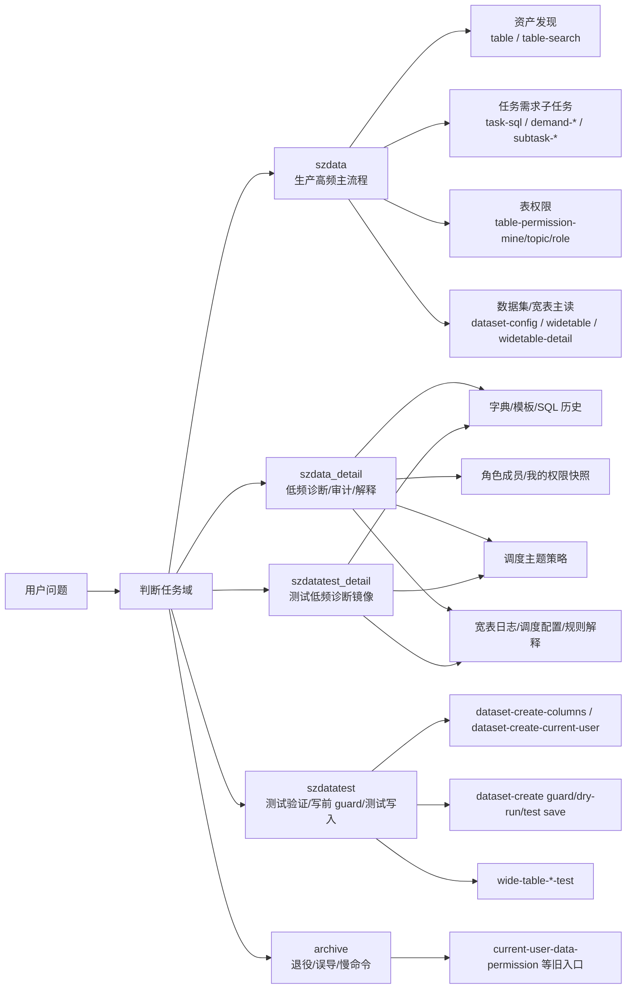
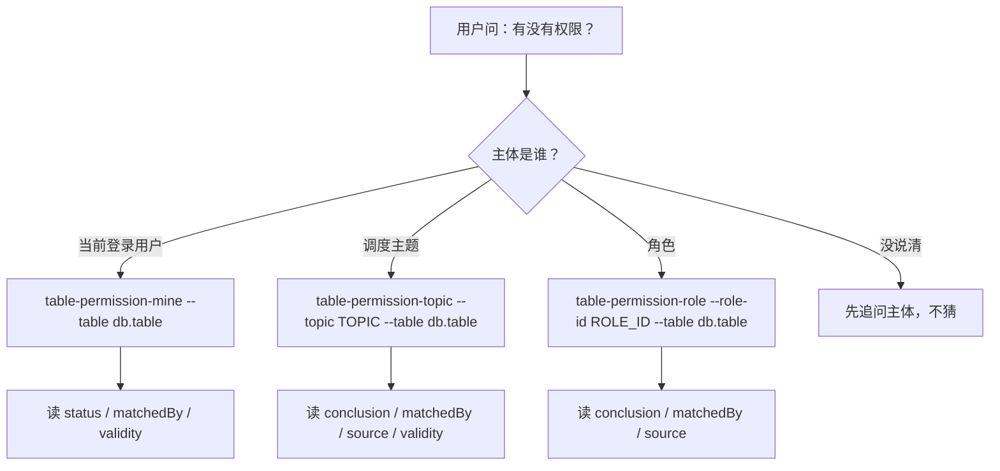
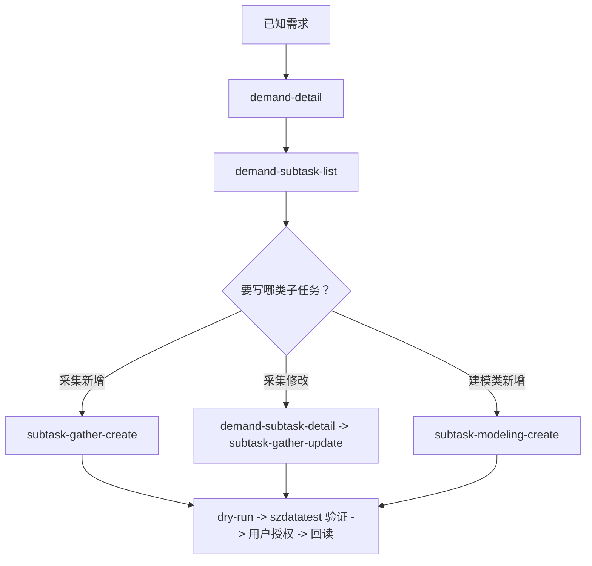

# SZData CLI 视觉索引

更新时间：2026-07-06

这份文档只帮助快速建立空间感，不是命令规则源。规则源和命令归属以 [szdata-command-landscape.md](./szdata-command-landscape.md) 为准；日常选择路径看 [szdata.md](./szdata.md)。

## 入口关系

## 6 个主任务域

| 任务域 | 先看哪个文档 | 主入口 |
| --- | --- | --- |
| 数据资产发现 | [szdata-command-landscape.md](./szdata-command-landscape.md#数据资产发现) | `table` / `table-search` |
| 任务、需求、子任务 | [szdata-command-landscape.md](./szdata-command-landscape.md#任务需求子任务) | `task-sql` / `demand-list` / `demand-detail` / `subtask-*` |
| 权限与主体诊断 | [szdata-command-landscape.md](./szdata-command-landscape.md#权限与主体诊断) | `table-permission-mine` / `table-permission-topic` / `table-permission-role` |
| 数据集读回与测试配置 | [szdata-command-landscape.md](./szdata-command-landscape.md#数据集读回与测试配置) | `dataset-config` |
| 宽表管理 | [szdata-command-landscape.md](./szdata-command-landscape.md#宽表管理) | `widetable` / `widetable-detail` |
| 支撑入口 | [szdata-command-landscape.md](./szdata-command-landscape.md#支撑入口) | `login` / `szdata_detail portal-help` / `szdatatest_detail portal-help` |

## 权限快速判断

旧入口 `current-user-data-permission`、`my-permission-base`、`my-permission-data`、`my-permission-function`、`my-permission-report`、`role-data-permission`、`role-summary`、`scheduling-topic-table-check`、`table-permission-check` 不再作为 agent 工作流入口。

## 子任务路由

## 文档优先级

1. 全局归属和选择规则：[szdata-command-landscape.md](./szdata-command-landscape.md)
2. 日常入口指南：[szdata.md](./szdata.md)
3. 低频 detail router：[szdata-detail.md](./szdata-detail.md)
4. 写操作和复杂流程：[szdata-operations/README.md](./szdata-operations/README.md)
5. live adapter 本地地图：`C:\Users\13246\.opencli\clis\szdata\COMMANDS.md` 和 `C:\Users\13246\.opencli\clis\szdatatest\COMMANDS.md`
6. 四入口一致性审计：`node C:\Users\13246\.opencli\shared\szdata-core\audit-surfaces.mjs --plain`
